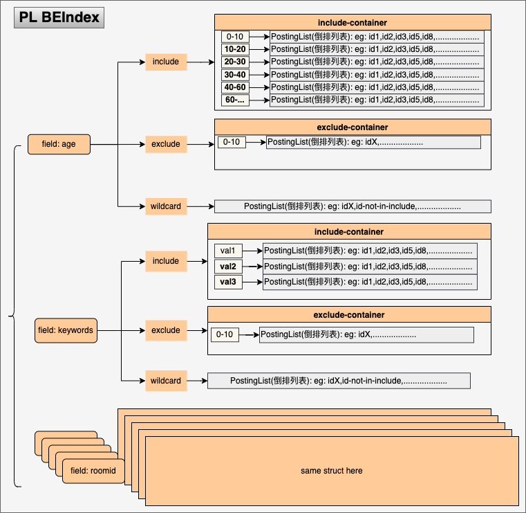

# Boolean Expression Index

## Boolean expression index


算法描述来源于论文：[Boolean expression indexing](https://theory.stanford.edu/~sergei/papers/vldb09-indexing.pdf),
代码中附带了一份pdf[doc/vldb09-indexing.pdf](doc/vldb09-indexing.pdf).索引数据构建后的示意图见:
[boolean indexing arch](doc/vldb09_indexing.md),本库的作用是为了使用统一且规范的方式解决下面这种问题:

```bash
# 对于一系列规则(布尔规则)描述数据; 对于一个输入.判断哪些规则满足条件的库
# 广告/商品检索便是典型的例子, 某些规则引擎也非常合适

dataset:
item1:  {city in [city1, city2] && isVIP is true}
item2:  {age > 18 && city not in [city1, city2] && isVIP is true}  #(eg: aldult video)
.... 0-亿级别如此的数据; 当然更多数据建议使用工程分片实现更快的检索

当给定一个数据:
<=
city: beijing
age:  24
tag:  [xx-fans, xx, xx, xxx] # 多值特征
vip:  true|fals

检索输出数据中所有满足布尔条件描述限制的条目:
=> [item1, itemn, .....]
```

为什么写它:
- 大佬(Wolfhead)的实现并没有开源
- 网络上能看到的描述和实现模糊不清，完全不能够工程化
- 在线广告很多功能模块借助其可以实现非常优雅的代码实现
- 论文仅仅描述了核心算法逻辑,没有给出类似于多值查询等其他工程时实践和扩展的设计建议

本库是基于[C++实现移步](https://github.com/echoface/ltio/blob/master/components/boolean_indexer)逻辑的基础上，
进行整理改进之后的版本, 因为存在对信息存在编码和压缩，所以存在一些限制，使用时注意规避;

- 文档ID最大值限制为:`[-2^43, 2^43]`
  - YES: 支持负值
- 每个文档最多拥有256个Conjunction
  - 自定义Container不受此限制, 见Default容器的实现
- 每个DNF最大支持组合条件(field)个数256
  - 自定义Container不受此限制, 见Default容器的实现
- 支持自定义Tokenizer，见parser的定义
- 支持容器扩展(eg:外部kv存储); 默认容器实现使用go内置map(hashmap)存储
- 内置支持模式匹配容器:(基于AC自动机,常用于上下文内容检索等)
- 内置数值容器:支持>,<,in/not运算符,用于支持无限集合范围布尔表达
  - 简而言之支持: **score > 20** 这样的布尔表达,常用于不方便业务转化具体枚举值的数值范围

在引入Aho-corasick模式匹配查找容器后，Index构建可能失败，因此对不可恢复错误引入了panic，
需要集成的应用自己recover对应的panic进行业务逻辑的处理，而对于AddDocument等返回error的API，
需要业务自行判断是否继续构建索引；目前当一个文档包含一个或者多个Conjunction时, 如果某个
Conjunction因提供的值不能被Parser/Holder 正确的解析成所需要的数据时,会跳过错误导致对应的
文档不被索引到; 可以通过`WithBadConjBehavior(Panic)` 指定具体的行为`ERR(default), Skip, Panic`
暴露此类问题或者检测对应的日志;

### usage:

```go
package main

import (
	"fmt"

	"github.com/echoface/be_indexer"
)

func buildTestDoc() []*be_indexer.Document {
	return []*be_indexer.Document{}
}

func main() {
	builder := be_indexer.NewIndexerBuilder(
		be_indexer.WithBadConjBehavior(be_indexer.SkipBadConj),
	)
	// or use a compacted version, it faster about 12% than default
	// builder := be_indexer.NewCompactIndexerBuilder()

	// optional special a holder/container for field
	// dever can also register customized container: see: entries_holder_factory.go
	builder.ConfigField("keyword", be_indexer.FieldOption{
		Container: be_indexer.HolderNameACMatcher,
	})

	for _, doc := range buildTestDoc() {
		_ = builder.AddDocument(doc) // see: document.go for how to construct doc
	}

	indexer := builder.BuildIndex()

	// indexing satisfied docs
	assigns := map[be_indexer.BEField]be_indexer.Values{
		"age":  be_indexer.NewIntValues(1),
		"city": be_indexer.NewStrValues("sh", "bj"),
		"tag":  be_indexer.NewStrValues("tag1", "tagn"),
	}

	result, e := indexer.Retrieve(assigns,
		be_indexer.WithStepDetail(),
		be_indexer.WithDumpEntries())
	fmt.Println(e, result)
}
```


## roaring bitmap based boolean expression index(roaringidx)

:

基于roaring bitmap的布尔索引实现，区别于Boolean expression indexing论文的实现，
利用bitmap在集合运算方面的优势实现的DNF Match逻辑，目前支持普通的倒排以及基于
AhoCorasick的字符串模式匹配逻辑实现。从benchmark 结果来看，在fields数量较多的
场景下性能相对于Boolean expression index的实现性能相对来说要差一些，但是其可理
解性要好一点。 借助roaring bitmap的实现，在文档数规模大、特征数较小的场景下可以
节省大量的内存。aho corasick 选型上也选取了使用double array trie的实现，索引上内存有所压缩。

NOTE：
- 文档ID范围[-2^56, 2^56]
- 单个Conjunction数量小于256个
- 使用前需要为业务中出现的每个字段提前完成配置

### usage
```go
package main

import (
	"fmt"

	"github.com/echoface/be_indexer"
	"github.com/echoface/be_indexer/parser"
	"github.com/echoface/be_indexer/roaringidx"
	"github.com/echoface/be_indexer/util"
)

func main() {

	builder := roaringidx.NewIndexerBuilder()

	builder.ConfigureField("ad_id", roaringidx.FieldSetting{
		Container: roaringidx.ContainerNameDefault,
		Parser:    parser.ParserNameNumber,
	})
	builder.ConfigureField("package", roaringidx.FieldSetting{
		Container: roaringidx.ContainerNameDefault,
		Parser:    parser.ParserNameStrHash,
	})
	builder.ConfigureField("keywords", roaringidx.FieldSetting{
		Container: roaringidx.ContainerNameAcMatch,
		Parser:    parser.ParserNameCommon,
	})

	doc1 := be_indexer.NewDocument(1)
	doc1.AddConjunction(be_indexer.NewConjunction().
		Include("ad_id", be_indexer.NewIntValues(100, 101, 108)).
		Exclude("package", be_indexer.NewStrValues("com.echoface.not")))
	doc1.AddConjunction(be_indexer.NewConjunction().
		Include("package", be_indexer.NewStrValues("com.echoface.in")))

	doc3 := be_indexer.NewDocument(20)
	doc3.AddConjunctions(be_indexer.NewConjunction())

	doc4 := be_indexer.NewDocument(50)
	doc4.AddConjunction(be_indexer.NewConjunction().
		Exclude("ad_id", be_indexer.NewIntValues(100, 108)).
		Include("package", be_indexer.NewStrValues("com.echoface.be")))

	builder.AddDocuments(doc1, doc3, doc4)

	indexer, err := builder.BuildIndexer()
	util.PanicIfErr(err, "should not err here")

	scanner := roaringidx.NewScanner(indexer)
	conjIDs, err := scanner.Retrieve(map[be_indexer.BEField]be_indexer.Values{
		"ad_id":   []interface{}{100, 102},
		"package": []interface{}{"com.echoface.be", "com.echoface.not"},
	})
	fmt.Println(roaringidx.FormatBitMapResult(conjIDs))
	scanner.Reset()
}
```


## Copyright and License

Copyright (C) 2018, by HuanGong [gonghuan.dev@gmail.com](mailto:gonghuan.dev@gmail.com).

Under the MIT License.

See the [LICENSE](LICENSE) file for details.
