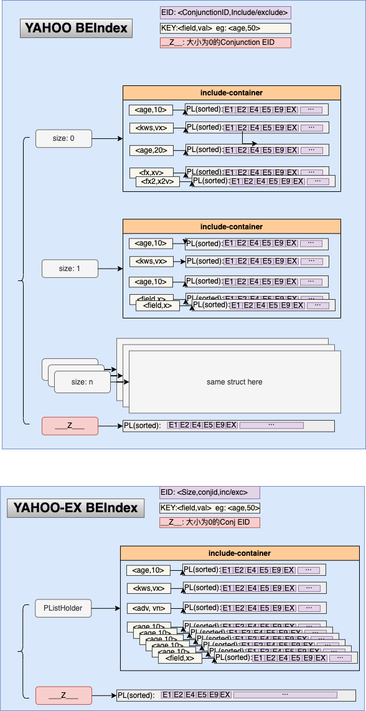

# Boolean Expression Index

## Boolean expression index

:

算法描述来源于论文：[Boolean expression indexing](https://theory.stanford.edu/~sergei/papers/vldb09-indexing.pdf),代码中也附带
了一份pdf[doc/vldb09-indexing.pdf](doc/vldb09-indexing.pdf).

为什么写它:
- 大佬(Wolfhead)的实现并没有开源
- 网络上能看到的描述和实现模糊不清，完全不能够工程化
- 在线广告很多功能模块借助其可以实现非常优雅的代码实现
- 论文仅仅描述了核心算法逻辑,没有给出类似于多值查询等其他工程时实践和扩展的设计建议

本库是基于[C++实现移步](https://github.com/echoface/ltio/blob/master/components/boolean_indexer)逻辑的基础上，进行整理改进之后的版本

因为存在对信息存在编码和压缩，所以存在一些限制，使用时注意规避:
- 文档ID最大值限制为:`[-2^43, 2^43]`
- 每个文档最多拥有256个Conjunction
- 每个DNF最大支持组合条件(field)个数：256
- 支持自定义Tokenizer，见parser的定义
- 支持容器扩展(eg:外部kv存储); 默认容器是hashmap,因抽用了8bit存储field，所以最大值：2^56
- 支持模式匹配逻辑查询(基于AC自动机,用于上下文内容定向等等)

在引入Aho-corasick模式匹配查找容器后，Indexer的构建可能失败，整个库中因为一些限制，不允许一些错误的出现，否则布尔逻辑可能失败，因此对不可恢复错误引入了panic，需要集成的应用自己recover对应的panic进行业务逻辑的处理，而对于AddDocument 等允许返回错误的借口，需要业务自行判断是否继续构建索引；注意这里可能出现逻辑错误:eg：`docID: {"age" in [16...100] && "badField" not in ["ValueCantParser"]}`可能出现部分逻辑表达已经添加进索引(`"age" in [16...100]`)，但另一部分`"badField" not in ["ValueCantParser"]`并没有构建成功而返回错误， 如果此时允许错误而继续构建索引数据，那么对于查询`{age: 20, badField:"被排除的值"}` 会得到满足的文档`docID`，而这是一个逻辑错误，因为`被排除的值` 是这个文档排除的表达式一部分，但是因为AddDocument中的错误而没有构建进索引数据中.

### usage:

```go
package main

import (
	"fmt"
	"github.com/echoface/be_indexer/parser"
	"github.com/echoface/be_indexer/util"
	"github.com/echoface/be_indexer"
)

func buildTestDoc() []*be_indexer.Document {
	return []*be_indexer.Document{}
}

func main() {
	builder := be_indexer.NewIndexerBuilder()
	// or use a compacted version, it faster about 12% than default
	// builder := be_indexer.NewCompactIndexerBuilder()

	// optional special a holder/container for field
	builder.ConfigField("keyword", be_indexer.FieldOption{
		Parser:    nil,
		Container: be_indexer.HolderNameACMatcher,
	})

	for _, doc := range buildTestDoc() {
		err := builder.AddDocument(doc)
		util.PanicIfErr(err, "document can't be resolved")
	}

	indexer := builder.BuildIndex()

	result, e := indexer.Retrieve(map[be_indexer.BEField]be_indexer.Values{
		"age": be_indexer.NewValues2(5),
	})
	fmt.Println(e, result)

	result, e = indexer.Retrieve(map[be_indexer.BEField]be_indexer.Values{
		"ip": be_indexer.NewStrValues2("localhost"),
	})
	fmt.Println(e, result)

	result, e = indexer.Retrieve(map[be_indexer.BEField]be_indexer.Values{
		"age":  be_indexer.NewIntValues2(1),
		"city": be_indexer.NewStrValues2("sh"),
		"tag":  be_indexer.NewValues2("tag1"),
	}, be_indexer.WithStepDetail(), be_indexer.WithDumpEntries())
	fmt.Println(e, result)
}
```


## roaring bitmap based boolean expression index(roaringidx)

:

基于roaring bitmap的布尔索引实现，相对于Boolean expression index论文的实现，是利用bitmap在集合运算方面的优势实现的DNF Match逻辑，目前支持普通的倒排以及基于AhoCorasick的字符串模式匹配逻辑实现。从benchmark 结果来看，在fields数量较多的场景下性能相对于Boolean expression index的实现性能相对来说要差一些，但是其可理解性要好一点。 借助roaring bitmap的实现，在文档数规模大、特征数较小的场景下可以节省大量的内存。aho corasick 选型上也选取了使用double array trie的实现，索引上内存有所压缩。

限制：
- 文档ID范围[-2^56, 2^56]
- 单个Conjunction数量小于256个

### usage
```go
package main

import (
	"fmt"

	"github.com/echoface/be_indexer"
	"github.com/echoface/be_indexer/parser"
	"github.com/echoface/be_indexer/roaringidx"
	"github.com/echoface/be_indexer/util"
)

func main() {

	builder := roaringidx.NewIndexerBuilder()

	builder.ConfigureField("ad_id", roaringidx.FieldSetting{
		Container: roaringidx.ContainerNameDefault,
		Parser:    parser.ParserNameNumber,
	})
	builder.ConfigureField("package", roaringidx.FieldSetting{
		Container: roaringidx.ContainerNameDefault,
		Parser:    parser.ParserNameStrHash,
	})
	builder.ConfigureField("keywords", roaringidx.FieldSetting{
		Container: roaringidx.ContainerNameAcMatch,
		Parser:    parser.ParserNameCommon,
	})

	doc1 := be_indexer.NewDocument(1)
	doc1.AddConjunction(be_indexer.NewConjunction().
		Include("ad_id", be_indexer.NewIntValues(100, 101, 108)).
		Exclude("package", be_indexer.NewStrValues("com.echoface.not")))
	doc1.AddConjunction(be_indexer.NewConjunction().
		Include("package", be_indexer.NewStrValues("com.echoface.in")))

	doc3 := be_indexer.NewDocument(20)
	doc3.AddConjunctions(be_indexer.NewConjunction())

	doc4 := be_indexer.NewDocument(50)
	doc4.AddConjunction(be_indexer.NewConjunction().
		Exclude("ad_id", be_indexer.NewIntValues(100, 108)).
		Include("package", be_indexer.NewStrValues("com.echoface.be")))

	builder.AddDocuments(doc1, doc3, doc4)

	indexer, err := builder.BuildIndexer()
	util.PanicIfErr(err, "should not err here")

	scanner := roaringidx.NewScanner(indexer)
	conjIDs, err := scanner.Retrieve(map[be_indexer.BEField]be_indexer.Values{
		"ad_id":   []interface{}{100, 102},
		"package": []interface{}{"com.echoface.be", "com.echoface.not"},
	})
	fmt.Println(roaringidx.FormatBitMapResult(conjIDs))
	scanner.Reset()
}
```


## Copyright and License

Copyright (C) 2018, by HuanGong [gonghuan.dev@gmail.com](mailto:gonghuan.dev@gmail.com).

Under the MIT License.

See the [LICENSE](LICENSE) file for details.
