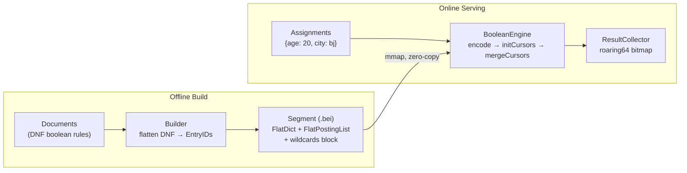
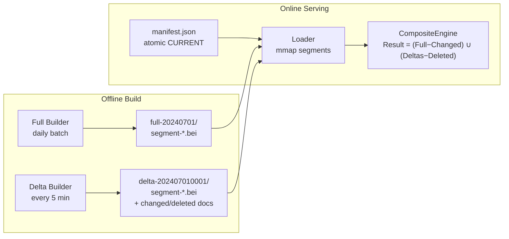
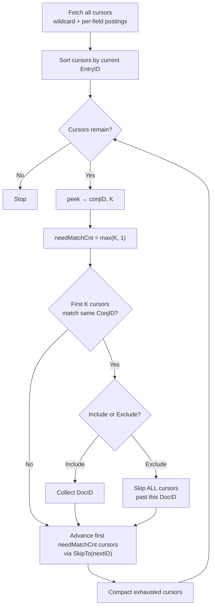
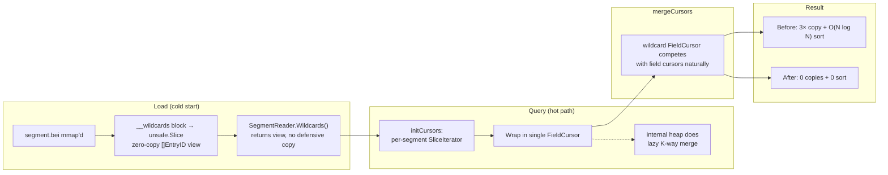

# be_indexer

基于 VLDB 09 论文 *Indexing Boolean Expressions* 的高性能布尔表达式索引 SDK，提供读写分离、mmap 友好的 Segment v4，以及 full + delta 增量快照。

项目首先保证布尔规则语义、数据完整性和线上可用性，再通过 mmap zero-copy、游标归并、外排和对象复用降低延迟与内存开销。低分配是性能手段，不是削弱功能的约束。

**适用场景**：广告定向、推荐规则过滤、复杂规则引擎。

## Architecture

### Core Pipeline


```mermaid
flowchart LR
    subgraph Offline["Offline Build"]
        D["Documents\n(DNF boolean rules)"] --> B["Builder\nflatten DNF → EntryIDs"]
        B --> S["Segment (.bei)\nFlatDict + FlatPostingList\n+ wildcards block"]
    end
    subgraph Online["Online Serving"]
        Q["Assignments\n{age: 20, city: bj}"] --> E["BooleanEngine\nencode → initCursors → mergeCursors"]
        S -->|mmap, zero-copy| E
        E --> R["ResultCollector\nroaring64 bitmap"]
    end
```

**Key insight:** K (number of INCLUDE predicates per conjunction) is encoded in EntryID bits 56–63. EntryIDs with the same K sort together naturally — no physical K-bucketing needed. The `mergeCursors` algorithm reads K dynamically from each EntryID.

### Layered Architecture

<div style="font-family: -apple-system, BlinkMacSystemFont, 'Segoe UI', sans-serif; max-width: 420px; margin: 20px 0;">
  <div style="display: flex; flex-direction: column; align-items: center; gap: 4px;">
    <div style="background: #ffeecc; border: 2px solid #d4a04a; border-radius: 6px; padding: 8px 28px; font-weight: 600;">Application</div>
    <div style="color: #666; font-size: 16px;">↓ &nbsp; ↓</div>
    <div style="display: flex; gap: 10px;">
      <div style="background: #d4edda; border: 1px solid #28a745; border-radius: 6px; padding: 6px 12px; text-align: center; font-size: 12px;">
        <div style="font-weight: 600;">builder</div><div style="color: #666;">offline</div>
      </div>
      <div style="background: #d1ecf1; border: 1px solid #17a2b8; border-radius: 6px; padding: 6px 12px; text-align: center; font-size: 12px;">
        <div style="font-weight: 600;">engine</div><div style="color: #666;">online</div>
      </div>
    </div>
    <div style="color: #666; font-size: 16px;">↓</div>
    <div style="background: #f5deb3; border: 1px solid #d4a04a; border-radius: 6px; padding: 6px 20px; text-align: center; font-size: 12px;">
      <div style="font-weight: 600;">segment</div><div style="color: #666;">mmap r/o, zero-copy</div>
    </div>
    <div style="color: #666; font-size: 16px;">↓</div>
    <div style="background: #f0e0e0; border: 1px solid #c08080; border-radius: 6px; padding: 6px 20px; text-align: center; font-size: 12px;">
      <div style="font-weight: 600;">core</div><div style="color: #666;">types, ConjID/EntryID encoding</div>
    </div>
  </div>
</div>

### Production: Full + Delta

For incremental updates, segments are organized into full + delta snapshots with atomic manifest switching:


```mermaid
flowchart LR
    subgraph Build["Offline Build"]
        FB["Full Builder\ndaily batch"] --> FS["full-20240701/\nsegment-*.bei"]
        DB["Delta Builder\nevery 5 min"] --> DS["delta-202407010001/\nsegment-*.bei\n+ changed/deleted docs"]
    end
    subgraph Serve["Online Serving"]
        M["manifest.json\natomic CURRENT"] --> L["Loader\nmmap segments"]
        FS --> L
        DS --> L
        L --> CE["CompositeEngine\nResult = (Full−Changed) ∪ (Deltas−Deleted)"]
    end
```

---

## Quick Start

```go
import "github.com/echoface/be_indexer"

// 1. Define fields
fields := map[be_indexer.BEField]*be_indexer.FieldMeta{
    "age":  {ID: 1, Field: "age",  FieldOption: be_indexer.FieldOption{IndexType: "ext_range", Encoder: "ext_range"}},
    "city": {ID: 2, Field: "city", FieldOption: be_indexer.FieldOption{IndexType: "default"}},
}

// 2. Build documents
doc1 := be_indexer.NewDocument(1).AddConjunction(
    be_indexer.NewConjunction().Between("age", 18, 25).
                                In("city", be_indexer.NewStrValues("beijing")),
)
doc2 := be_indexer.NewDocument(2).AddConjunction(
    be_indexer.NewConjunction().NotIn("city", be_indexer.NewStrValues("rural")),
)

// 3. Build segment
buf := new(bytes.Buffer)
_ = be_indexer.BuildSegment(buf, fields, []*be_indexer.Document{doc1, doc2}, be_indexer.BuildSegmentOptions{})

// 4. Load and query
reader, _ := be_indexer.NewSegmentReader(buf.Bytes())
engine, _ := be_indexer.NewEngine(fields, []*be_indexer.SegmentReader{reader})

results, _ := engine.Retrieve(be_indexer.Assignments{
    "age": []int{20}, "city": []string{"beijing"},
})
// → [1, 2]
```

---

## Production Pattern: Full + Delta with Manifest

For production serving with incremental updates, use the full+delta snapshot model:

### Build

```go
// Full build (offline, e.g. daily)
fullOpt := be_indexer.FullIndexBuildOption{
    Root:       "/data/index",
    Generation: 20240701,
    Fields:     fields,
    Options: be_indexer.BuildDirectoryOptions{
        SegmentSchemaHash: "sha256:your-schema-hash",
    },
}
full, _ := be_indexer.NewFullIndexBuilder(fullOpt)
for _, doc := range docs {
    full.AddDocument(doc)
}
fullDesc, _ := full.Build()

// Delta build (online, e.g. every 5 min)
deltaOpt := be_indexer.DeltaIndexBuildOption{
    Root:                 "/data/index",
    Generation:           202407010001,
    FromWatermarkExclusive: 0,
    ToWatermarkInclusive:   1 << 60,
    Fields:               fields,
    Options: be_indexer.BuildDirectoryOptions{
        SegmentSchemaHash: "sha256:your-schema-hash",
    },
}
delta, _ := be_indexer.NewDeltaIndexBuilder(deltaOpt)
for _, m := range mutations {
    delta.AddMutation(m)
}
deltaDesc, _ := delta.Build()

// Publish snapshot
manifest, _ := be_indexer.NewSnapshotManifest(be_indexer.SnapshotManifestRequest{
    IndexName:  "targeting",
    Generation: 202407010001,
    SchemaHash: "sha256:your-schema-hash",
    Full:       fullDesc,
    Deltas:     []be_indexer.DeltaIndexDescriptor{deltaDesc},
})
be_indexer.PublishManifest("/data/index", "manifest-1.json", manifest)
```

### Load & Serve

```go
engine, _ := be_indexer.OpenIndex("/data/index", fields, be_indexer.LoaderOptions{SegmentLoad: be_indexer.SegmentLoadMmapVerify})
results, _ := engine.Retrieve(assignments)
```

`SegmentLoadMmapVerify` 默认按 Manifest 校验文件尺寸和整文件 SHA-256，再建立 mmap。只有发布链路已完成可信校验且冷启动速度优先时，才应显式设置 `SegmentLoad: SegmentLoadMmapTrustPublished`；快速模式仍保留尺寸、Segment 结构、block 边界和 checksum 元数据格式检查。

### Live Reload

```go
holder, _ := be_indexer.NewIndexHolder("/data/index", fields, be_indexer.LoaderOptions{SegmentLoad: be_indexer.SegmentLoadMmapVerify})
// Reload when manifest changes (call Reload when notified of manifest update)
_ = holder.Reload()
results, _ := holder.Retrieve(assignments)
```

---

## Core Algorithms

### ID Encoding: K directly in EntryID

```
ConjID  = [ reserved(4) | K(8) | index(8) | negSign(1) | docID(43) ]
EntryID = ConjID << 4 | incl/excl
```

K (conjunction size: number of INCLUDE predicates) occupies bits 56–63 of EntryID. All EntryIDs with the same K sort together naturally — no physical K-bucketing needed. K is read dynamically via `conjID.Size()` during query.

### mergeCursors: Single-Pass Multiway Merge


```mermaid
flowchart TD
    A[Fetch all cursors\nwildcard + per-field postings] --> B[Sort cursors by current EntryID]
    B --> C{Cursors remain?}
    C -->|No| Z[Stop]
    C -->|Yes| D[peek → conjID, K]
    D --> E["needMatchCnt = max(K, 1)"]
    E --> F{First K cursors\nmatch same ConjID?}
    F -->|Yes| G{Include or Exclude?}
    F -->|No| H["Advance first needMatchCnt cursors\nvia SkipTo(nextID)"]
    G -->|Include| I[Collect DocID]
    G -->|Exclude| J[Skip ALL cursors\npast this DocID]
    I --> H
    J --> H
    H --> K[Compact exhausted cursors]
    K --> C
```

All cursors (wildcard + per-field postings from all segments) compete in a single sorted list. The algorithm reads K from each EntryID dynamically, requires `needMatchCnt = max(K, 1)` cursors to converge on the same ConjID, and naturally handles excludes via short-circuit skip.

### Galloping SkipTo

~90% of cursor advances are "next element" (+1). Full binary search is O(log N) every call. Galloping uses a fast-path check (O(1) for seq) and exponential probe for jumps:

| N=100K | Binary Search | Galloping | Speedup |
|:------|:---:|:---:|:---:|
| Seq (+1) | 15.1 μs | 4.1 μs | **3.7×** |
| Stride 16 | 167 μs | 58 μs | **2.9×** |
| Jump 64 | 1.73 μs | 1.66 μs | ≈equal |

该优化同时用于 `SliceIterator`（wildcard）和 `flatPostingCursor`（mmap posting）。`SkipTo` 循环本身不分配；完整查询仍允许为编码、游标组合和结果所有权进行受控分配，以端到端吞吐和延迟为最终指标。

### Zero-Copy Wildcards

Wildcards (K=0 conjunctions) are embedded in each segment as a `__wildcards` block. The mmap reader decodes them via `unsafe.Slice` — no heap allocation. At query time, per-segment `SliceIterator`s are grouped into a single `FieldCursor` whose internal heap performs **lazy K-way merge**, eliminating the need for a load-time merge step entirely.


```mermaid
flowchart LR
    subgraph Load["Load (cold start)"]
        L1["segment.bei mmap'd"] --> L2["__wildcards block → unsafe.Slice\nzero-copy []EntryID view"]
        L2 --> L3["SegmentReader.Wildcards()\nreturns view, no defensive copy"]
    end
    subgraph Query["Query (hot path)"]
        Q1["initCursors:\nper-segment SliceIterator"] --> Q2[Wrap in single FieldCursor]
        Q2 -.-> Q2a["internal heap does\nlazy K-way merge"]
    end
    subgraph Merge["mergeCursors"]
        M1["wildcard FieldCursor competes\nwith field cursors naturally"]
    end
    subgraph Result["Result"]
        R1["Before: 3× copy + O(N log N) sort"]
        R2["After: 0 copies + 0 sort"]
    end
    L3 --> Q1
    Q2 --> M1
    M1 --> R1
    M1 --> R2
```

---

## Performance

### Memory Footprint (5M docs, 10 fields/doc, ~50M EntryIDs)

| Component | Memory | Notes |
|:----------|:------|:------|
| Segment file | ~404 MB | on disk / virtual addr (mmap) |
| SegmentReader (RSS) | ~270 KB | dict + pointers, rest is mmap views |
| BooleanEngine | ~2 KB | schema codec only |
| Per-query (hot) | ~61 KB | cursors + collector |
| First-query RSS growth | ~5 MB | touched posting pages faulted into page cache |
| Steady-state RSS | ~4-10 MB | hot posting pages in page cache |

### Roaring64 Wildcard Benchmarks (N=100K)

| | Raw []EntryID | Roaring64 |
|:--|:---:|:---:|
| Storage (dense) | 800 KB | 200 KB (25%) |
| Load (deserialize) | 76 μs | 38 μs (2× faster) |
| SkipTo seq scan | 3.9 ms | 2.1 ms (1.9× faster) |

A pre-built roaring64 sidecar is available as an optional storage/load optimization (see `core/wildcard_iter_bench_test.go`).

---

## Segment Binary Format (v4)

<div style="font-family: 'SF Mono', 'Fira Code', monospace; font-size: 12px; margin: 20px 0; line-height: 1.6;">
  <div style="display: flex; flex-direction: column; gap: 0; max-width: 560px;">
    <div style="background: #e0e0e0; border: 1px solid #999; border-radius: 4px; padding: 6px 12px; font-weight: 600;">
      MagicNumber &nbsp; <code>"BEIDX\0\0\4"</code> <span style="color: #888;">(8B)</span>
    </div>
    <div style="text-align: center; color: #999;">▼</div>
    <div style="border: 2px solid #666; border-radius: 6px; padding: 10px 12px; background: #f8fdf8;">
      <div style="font-weight: 600; margin-bottom: 6px;">Per Field <span style="font-weight: 400; color: #666;">(sorted by name)</span></div>
      <div style="display: flex; gap: 8px; flex-wrap: wrap;">
        <div style="background: #d4edda; border: 1px solid #28a745; border-radius: 3px; padding: 4px 8px; font-size: 11px;">
          field_postings<br>FlatPostingList<br><span style="color: #666;">(count + N×EntryID)</span>
        </div>
        <div style="background: #d4edda; border: 1px solid #28a745; border-radius: 3px; padding: 4px 8px; font-size: 11px;">
          field_dict<br>FlatDict<br><span style="color: #666;">(term→PostingRef)</span>
        </div>
        <div style="background: #e8e0f0; border: 1px solid #9b59b6; border-radius: 3px; padding: 4px 8px; font-size: 11px;">
          field_ac_matcher<br>Double-Array Trie
        </div>
        <div style="background: #e8e0f0; border: 1px solid #9b59b6; border-radius: 3px; padding: 4px 8px; font-size: 11px;">
          field_ext_range<br>Segment-Tree
        </div>
      </div>
    </div>
    <div style="text-align: center; color: #999;">▼</div>
    <div style="background: #d1ecf1; border: 1px solid #17a2b8; border-radius: 4px; padding: 6px 12px;">
      __wildcards &nbsp; <span style="color: #666;">BEIENT1 format (magic+count+N×EntryID)</span>
    </div>
    <div style="text-align: center; color: #999;">▼</div>
    <div style="background: #fff3cd; border: 1px solid #ffc107; border-radius: 4px; padding: 6px 12px;">
      MetaBlock &nbsp; <span style="color: #666;">(JSON)</span>
    </div>
    <div style="text-align: center; color: #999;">▼</div>
    <div style="background: #e0e0e0; border: 1px solid #999; border-radius: 4px; padding: 6px 12px;">
      MetaOffset &nbsp; <span style="color: #666;">(uint64 LE, 8B)</span>
    </div>
  </div>
  <div style="margin-top: 8px; color: #666; font-size: 11px; font-style: italic;">
    All blocks 8-byte aligned → zero-copy unsafe.Slice
  </div>
</div>

All posting blocks and the wildcards block are 8-byte aligned, enabling zero-copy `unsafe.Slice` mapping from mmap'd memory.

---

## Pluggable Containers

Field-level index containers are registered via `segment.RegisterIndex(kind, IndexDef)`:

| Container | Index | `FieldOption.IndexType` | Use Case | Lookup |
|:----------|:------|:------------------------|:---------|:-------|
| [Default](static/docs/indexes/default.md) | Inverted posting list (FlatDict) | `"default"` or `""` | Exact match (EQ, IN, NOT IN) | `O(log n)` |
| [`mph_dict`](static/docs/indexes/mph_dict.md) | Minimal perfect hash (CHD) | `"mph_dict"` | Huge opaque key sets (ids, hashes) | `O(1)` |
| [`fst_dict`](static/docs/indexes/fst_dict.md) | Finite state transducer (vellum) | `"fst_dict"` | Huge structured keys (URLs, paths) | `O(len(term))` |
| [`ac_matcher`](static/docs/indexes/ac_matcher.md) | Double-Array Trie (AC automaton) | `"ac_matcher"` | Multi-pattern substring match | `O(len(text))` |
| [`ext_range`](static/docs/indexes/ext_range.md) | Segment-tree + point range index | `"ext_range"` | Numeric range (GT, LT, BETWEEN) | `O(log P + log m)` |

See **[static/docs/indexes/](static/docs/indexes/README.md)** for a per-container
reference (when to use / when not, complexity, and on-disk layout) and a decision
guide.

Custom containers implement `IndexBuilder` / `IndexReader` and register at init. See `container/example/` for a complete template.

---

## Value Tokenizers

Tokenizers convert typed values to string terms for the inverted index. The `FieldOption.Encoder` field selects the tokenizer (defaults to `IndexType` when empty):

| Tokenizer | Input | Output | `FieldOption.Encoder` |
|:----------|:------|:-------|:------------------------|
| `default` | `string` | identity | `"default"` |
| `number` | `int`/`int64` | `"<int>"` | `"number"` |
| `geohash` | `[lat, lng]` | geohash prefixes | `"geohash"` |
| [`proximitygeo`](static/docs/indexes/proximitygeo.md) | `(lat, lng, radius)` | geohash covering cells (stored in the default container) | `"proximitygeo"` |

Custom tokenizers implement `parser.ValueTokenizer` and register via `parser.RegisterPredicateEncoder`.

---

## Observability

```go
engine.Retrieve(assignments,
    be_indexer.WithObserver(&retrieveObserver{}),
)
```

`RetrieveObserver` hooks into retrieval lifecycle: `OnRetrieveStart`, `OnRetrieveEnd`, `OnMatch`, `OnExcludeSkip`, `OnCursorInit`.

---

## Build & Test

```bash
make test     # go test -v -cover ./...
make build    # go build ./...
go vet ./...
```

## Constraints

- `DocID` range: `[-2^43, 2^43]`
- Max conjunctions per document: < 256
- Max K (conjunction size): < 256
- Recommended docs per segment: ≤ 5M for balanced memory/build time

## Documentation

- [Quick Start](static/docs/QUICK_START.md) — end-to-end build & query walkthrough
- [Architecture](static/docs/ARCHITECTURE.md) — layered design, ID encoding, retrieval
- [API Reference](static/docs/API_REFERENCE.md) — package-level API
- [Examples](static/docs/EXAMPLES.md) — recipes for common scenarios
- **[Field Index Types](static/docs/indexes/README.md)** — per-container reference
  (default, mph_dict, fst_dict, ac_matcher, ext_range, proximitygeo): when to use,
  complexity, and on-disk layout

## License

MIT
