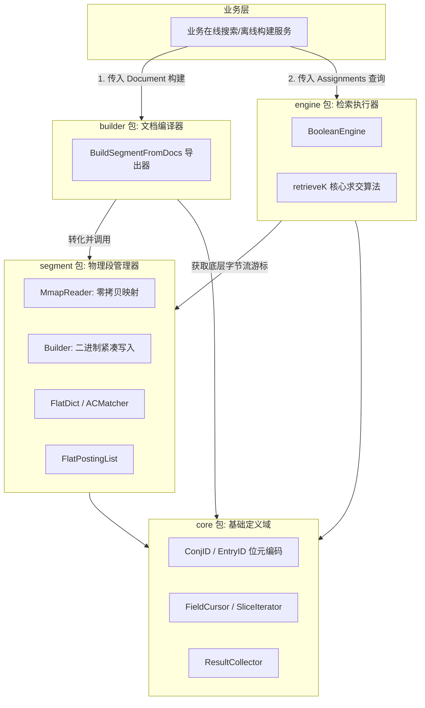

# be_indexer 读写分离与零拷贝架构设计

## 1. 架构背景与目标
`be_indexer` 是一个基于 VLDB 09 论文《Indexing Boolean Expressions》实现的高性能布尔表达式检索 SDK。为了解决在超大规模规则（如广告定向、复杂规则引擎）下索引加载慢、GC 抖动严重、以及难以水平扩展的问题，我们对其进行了彻底的重构。

**核心设计目标：**
1. **彻底分离读写 (Separation of Read and Write)**：构建端负责将业务文档（Document）编译为不可变的物理段（Segment），查询端从存储介质拉取段直接提供查询。
2. **零拷贝加载 (Zero-Copy / mmap)**：查询端通过内存映射（`mmap`）直接挂载二进制段文件，避免庞大的反序列化开销和 GC 抖动，实现毫秒级加载。
3. **高内聚的领域包划分 (Domain-Driven Packages)**：通过 `core`、`builder`、`segment`、`engine` 的严格分层，保证各个领域的职责单一。

---

## 2. 总体架构与包结构

当前的 SDK 被拆分为 4 个高度解耦的子包：



### 2.1 包职责说明
1. **`core`**：定义极简的基础类型。包含基于 64-bit 整数的 `ConjID` 和 `EntryID` 编解码逻辑、多路合并游标 `FieldCursor` 以及结果收集器 `ResultCollector`。
2. **`segment`**：物理存储层，解决数据如何在磁盘与内存间最快传输。包含将 `EntryID` 数组转化为紧凑二进制大文件的 `Builder`，以及基于 mmap 的 `MmapReader`。内部实现了针对高基数字段的 `FlatDict` 和针对多模式匹配的 `ACMatcher`（双数组 Trie）。
3. **`builder`**：高级构建层，作为人类可读文档到机器二进制的翻译官。通过 `BuildSegmentFromDocs` 将复杂的 `Document`（DNF 范式）展平为底层的倒排链数据，并抽取 K=0 的 `Wildcard` 规则。
4. **`engine`**：查询执行层。`BooleanEngine` 管理多个 `MmapReader`，在拿到底层游标后，执行极致优化的 K-Groups 并行降维和排异（Exclude 短路）算法。

---

## 3. 核心机制设计

### 3.1 紧凑的位元编码 (Compact ID Encoding)
为了实现极速的求交计算，`be_indexer` 将文档和子句信息压缩到了单一的 64-bit 整数中：
- **`ConjID`**：`[ reserved(4bit) | size/K(8bit) | index(8bit) | negSign(1bit) | docID(43bit) ]`。通过比较 `ConjID`，可以瞬间确认两个倒排条目是否属于同一个文档的同一个子句。
- **`EntryID`**：`[--ConjID(60bit)--|--empty(3bit)--|--incl/excl(1bit)--]`。在 `ConjID` 的基础上附加了“包含/排除”标记。

### 3.2 K-Groups 倒排划分 (K-Partitioning)
物理段文件按照 `K`（一个 Conjunction 中包含的 Include 条件数量）进行隔离存储。
- **构建时**：不同 K 值的倒排链被分发到不同的文件块中。
- **查询时**：引擎按 K 值倒序（从 maxK 到 0）拉取游标进行求交计算。在 mmap 环境下，如果查询只需要评估 K=1 的条件，操作系统甚至不会将 K=2 的物理页载入内存，完美适配 Page Cache。

### 3.3 Z-Entry 短路排异 (Exclude Short-Circuiting)
对于 `NOT IN`（Exclude）条件，引擎提供了 First-class 支持。
- 在 `retrieveK` 算法中，当游标扫描到首尾 `ConjID` 一致且该条件为 Exclude 时，说明当前文档触发了 `NOT IN` 约束。
- 引擎会立刻通过 `SkipTo(nextID)` 跳过该文档的所有后续游标，避免无用的匹配计算，将原本可能拖慢性能的排除条件转化为加速剪枝的利器。

### 3.4 零拷贝的多模式匹配 (Zero-Copy AC Automaton)
针对需要子串匹配的场景（如上下文白名单），段内直接集成了基于双数组 Trie（Double-Array Trie, DAT）的 `ACMatcher`。
- DAT 的 `base` 和 `check` 数组在构建时被序列化为连续的二进制块。
- 查询时，mmap 直接将这块内存映射为 `[]uint32`，状态机的跳转完全在只读的连续内存上进行，实现了真正的零拷贝多模式匹配。

---

## 4. Segment 二进制文件布局规范

所有的数据自包含，采用严格的顺序块和尾部索引表布局：

```text
+-------------------------------------------------+
| Magic Number (8 bytes, "BEIDX\0\0\1")           |
+-------------------------------------------------+
| Block 1: Flat Posting Lists (K=1, Field A)      |
+-------------------------------------------------+
| Block 2: Flat Dict / ACMatcher (K=1, Field A)   |
+-------------------------------------------------+
| Block 3: Flat Posting Lists (K=2, Field B)      |
+-------------------------------------------------+
| ... Other Fields and K-Groups ...               |
+-------------------------------------------------+
| Segment Metadata Block (JSON)                   |
| - Version, Document Count                       |
| - Field Definitions (Name, ID, Container, etc.) |
| - Block Index Table (Block Name -> Offset/Size) |
+-------------------------------------------------+
| Meta Length (8 bytes, uint64)                   |
+-------------------------------------------------+
```
查询端初始化时，仅需读取文件最后 8 个字节获取 Meta 长度，反序列化尾部的 JSON 元数据，随后即可根据 Offset 信息按需懒加载任意倒排链和字典。
