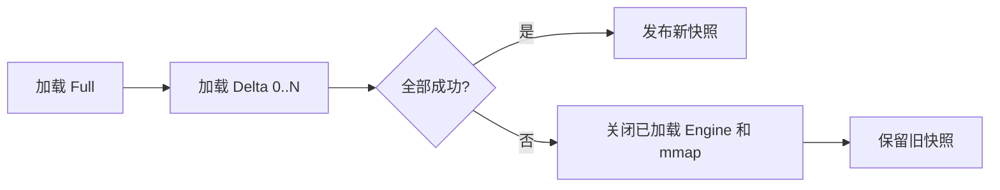

# Boolean Expression Indexer API 参考

## 目录

1. [概述](#概述)
2. [核心模型 (core)](#核心模型-core)
3. [离线构建 API (builder)](#离线构建-api-builder)
4. [物理段 API (segment)](#物理段-api-segment)
5. [检索执行 API (engine)](#检索执行-api-engine)

---

## 概述

be_indexer 是一个高性能的布尔表达式索引引擎，它在最新的架构中被划分为四个核心领域包：
- `core`: 基础原语与结构定义。
- `builder`: 将逻辑文档编译为扁平的物理段。
- `segment`: 管理底层存储与零拷贝 `mmap` 的读写。
- `engine`: 基于 K-Groups 算法进行多路归并求交。

---

## 核心模型 (core)

### Document

文档结构，表示一个可索引的布尔规则集合（DNF 范式，各 Conjunction 之间是 OR 关系）。

```go
type Document struct {
    ID      DocID          `json:"id"`      // 文档 ID
    Version uint64         `json:"version"` // 业务版本号
    Cons    []*Conjunction `json:"cons"`    // 布尔表达式列表（OR 关系）
}

// 创建新文档
func NewDocument(id DocID) *Document

// 添加Conjunction
func (doc *Document) AddConjunction(cons ...*Conjunction) *Document
```

### Conjunction

表示一个 AND 表达式组。包含多个 Predicate 约束。

```go
type Conjunction struct {
    Predicates map[BEField][]*ValueExpr `json:"predicates"`
}

// 创建新Conjunction
func NewConjunction() *Conjunction

// 添加包含条件 (In)
func (conj *Conjunction) In(field BEField, values Values) *Conjunction

// 添加排除条件 (NotIn)
func (conj *Conjunction) NotIn(field BEField, values Values) *Conjunction
```

### FieldMeta

定义字段的属性和所使用的底层存储容器（如默认的哈希，或是 AC 自动机）。

```go
type FieldMeta struct {
    FieldOption
    ID    uint64
    Field BEField
}

type FieldOption struct {
    IndexType string // 物理容器：default、ac_matcher、ext_range 等
    Encoder   string // 值编码器：default、number、ext_range 等
}
```

### Assignments

查询时的属性赋值，将字段映射到用户特征上。

```go
type Assignments map[BEField]interface{}
```

---

## 离线构建 API (builder)

### BuildSegmentFromDocs

这是构建过程的唯一核心入口，负责将内存中的 `Document` 列表转换为二进制的紧凑物理段。

```go
// BuildSegmentFromDocs 将文档写入一个可 mmap 的 Segment v4。
// wildcard 直接内嵌在 Segment 中。
func BuildSegmentFromDocs(
    w io.Writer, 
    fieldsData map[core.BEField]*core.FieldMeta, 
    docs []*core.Document,
    opts BuildSegmentFromDocsOptions,
) error
```

**示例：**
```go
fieldsMeta := map[core.BEField]*core.FieldMeta{
    "age": {Field: "age", ID: 1, FieldOption: core.FieldOption{IndexType: core.IndexNameDefault, Encoder: "number"}},
}

docs := []*core.Document{ /* ... */ }
file, _ := os.Create("data.seg")
defer file.Close()

err := builder.BuildSegmentFromDocs(file, fieldsMeta, docs, builder.BuildSegmentFromDocsOptions{})
```

多 Segment 批量构建使用 `BuildSegmentsFromDocs`。该入口在创建任何 writer 前校验整个输入集合的 DocID 唯一性，避免相同 DocID 跨 Segment 落入同一个 ConjID 空间。超大规模全量构建建议使用 `FullIndexBuilder` 的外排路径。

---

## 物理段 API (segment)

`segment` 包是对底层二进制文件的包装，核心面向检索端暴露的是 `SegmentReader`。

### SegmentReader

使用零拷贝方式映射并读取段文件内容。

```go
type SegmentReader struct {
    // 内部结构
}

// 从调用方持有的字节切片初始化 Reader
func NewSegmentReader(data []byte) (*SegmentReader, error)

// 对同一文件句柄完成尺寸/checksum 校验后建立 mmap
func OpenSegmentFile(path string, opts OpenFileOptions) (*SegmentReader, error)
```

> **注意：** 生产快照优先通过 `loader.OpenIndex` 或 `loader.NewHolder` 加载，由 Loader 统一传入 Manifest 尺寸、checksum 和 Schema。底层 `OpenSegmentFile` 在同一个已打开文件句柄上校验后再 mmap，避免路径被替换造成 TOCTOU。

---

## 检索执行 API (engine)

`engine` 包是查询的大脑，它组合不可变 Segment，并基于内嵌 wildcard 与字段 posting 执行 K-Groups 归并。

### BooleanEngine

核心检索引擎。

```go
type BooleanEngine struct {
    // 内部结构
}

// 初始化引擎
// fieldsData: 字段元数据定义
// segments: 可挂载多个 SegmentReader，引擎内部会透明处理合并
func NewBooleanEngine(
    fieldsData map[core.BEField]*core.FieldMeta, 
    segments []*segment.SegmentReader,
) (*BooleanEngine, error)

// 指定 LiveDocs 以支持动态删除/禁用文档
func (ms *BooleanEngine) SetLiveDocs(ld *core.LiveDocs)

// 基础 Retrieve 方法
func (ms *BooleanEngine) Retrieve(queries core.Assignments, opts ...core.IndexOpt) (*core.BitmapDocSet, error)

// 带自定义结果收集器的 Retrieve
func (ms *BooleanEngine) RetrieveWithCollector(queries core.Assignments, collector core.ResultCollector, opts ...core.IndexOpt) error
```

**检索示例：**
```go
// 1. 初始化引擎
searcher, err := engine.NewBooleanEngine(fieldsMeta, []*segment.SegmentReader{segReader})

// 2. 构造查询特征
assigns := core.Assignments{
    "age": []int{20, 25},
    "city": []string{"shanghai"},
}

// 3. 执行检索
docIDs, err := searcher.Retrieve(assigns)
if err != nil {
    panic(err)
}

fmt.Printf("Matched Docs: %v\n", docIDs)
```

## 快照加载与校验

```go
type Options struct {
    SchemaHash  string
    SegmentLoad SegmentLoadMode
}
```

| 加载方式 | 默认完整性校验 |
|---|---|
| `SegmentLoadHeapVerify` | 读取到 Go heap，校验 Manifest 文件尺寸和整文件 SHA-256 |
| `SegmentLoadMmapVerify` | 使用同一文件句柄校验尺寸和整文件 SHA-256，再建立 mmap |
| `SegmentLoadMmapTrustPublished` | 使用同一文件句柄校验尺寸后建立 mmap；仍校验 Segment 结构、边界和 checksum 元数据格式 |

快照加载遵循资源所有权事务：只有 Full、全部 Delta 和 sidecar 都成功时才返回新快照；中途失败会关闭此前已经创建的 Engine 和 mmap。`Holder.Reload` 失败时旧快照继续服务。



## 性能语义

mmap zero-copy 表示 posting 和 wildcard 的大型数据块无需复制到 Go heap。完整 `Retrieve` 可以为查询编码、游标组合和独立结果所有权产生受控临时分配；性能判断应以功能正确性、吞吐、P99 和内存峰值为准，而不是以“所有代码零分配”为单一目标。
