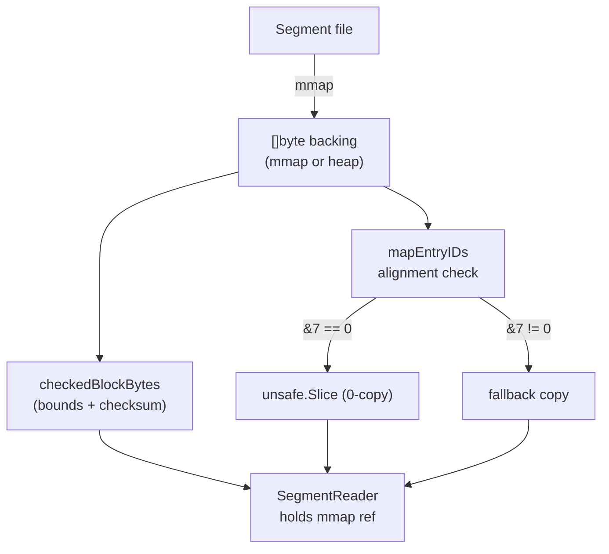

# Architecture Design

This document covers the internal architecture, core algorithms, physical layout, and extension mechanisms of be_indexer.

## 1. Layered Architecture

<div style="font-family: -apple-system, BlinkMacSystemFont, 'Segoe UI', sans-serif; max-width: 420px; margin: 20px 0;">
  <div style="display: flex; flex-direction: column; align-items: center; gap: 4px;">
    <div style="background: #ffeecc; border: 2px solid #d4a04a; border-radius: 6px; padding: 8px 28px; font-weight: 600;">Application</div>
    <div style="color: #666; font-size: 16px;">↓ &nbsp; ↓ &nbsp; ↓</div>
    <div style="display: flex; gap: 10px;">
      <div style="background: #d4edda; border: 1px solid #28a745; border-radius: 6px; padding: 6px 12px; text-align: center; font-size: 12px;">
        <div style="font-weight: 600;">builder</div><div style="color: #666;">offline</div>
      </div>
      <div style="background: #d6eaf8; border: 1px solid #2e86c1; border-radius: 6px; padding: 6px 12px; text-align: center; font-size: 12px;">
        <div style="font-weight: 600;">loader</div><div style="color: #666;">cold start</div>
      </div>
      <div style="background: #d1ecf1; border: 1px solid #17a2b8; border-radius: 6px; padding: 6px 12px; text-align: center; font-size: 12px;">
        <div style="font-weight: 600;">engine</div><div style="color: #666;">online</div>
      </div>
    </div>
    <div style="color: #666; font-size: 16px;">↓ &nbsp; ↓</div>
    <div style="background: #f5deb3; border: 1px solid #d4a04a; border-radius: 6px; padding: 6px 20px; text-align: center; font-size: 12px;">
      <div style="font-weight: 600;">segment</div><div style="color: #666;">mmap, r/o</div>
    </div>
    <div style="color: #666; font-size: 16px;">↓</div>
    <div style="background: #f0e0e0; border: 1px solid #c08080; border-radius: 6px; padding: 6px 20px; text-align: center; font-size: 12px;">
      <div style="font-weight: 600;">core</div><div style="color: #666;">types</div>
    </div>
  </div>
</div>

### 1.0 Layer Stack & Dependency Direction

依赖单向向下（上层依赖下层，下层不感知上层）。`core` 处于最底层，仅定义类型与接口，无业务逻辑。

```
be_indexer (公共 API / 类型重导出 / 工厂函数)
    └─> loader · manifest · compact   (装配层：冷启动、快照、压实策略)
            └─> engine                 (执行层：BooleanEngine / CompositeEngine)
                    ├─> builder        (构建层：DNF 文档 → 二进制段)
                    └─> parser         (解析层：SchemaCodec / Encoder / Tokenizer)
                            └─> segment (存储层：Builder 序列化 / SegmentReader 反序列化)
                                    └─> core (基础层：类型 + 接口 ONLY)
```

| Layer | 包 | 职责 |
|-------|----|------|
| 公共 API | `be_indexer.go` | 类型重导出、工厂函数 (NewEngine / BuildSegment / OpenIndex) |
| 装配 | `loader` `manifest` `compact` | 冷启动、CURRENT→快照、full+delta 合成、压实决策 |
| 执行 | `engine` | `mergeCursors` K-Groups 归并、CompositeEngine |
| 构建 | `builder` | DNF 文档 → 二进制段 (pull / push / delta) |
| 解析 | `parser` | SchemaCodec、Encoder.Build/Query、Tokenizer |
| 存储 | `segment` | FlatDict / FlatPostingList / 容器注册表 / mmap 零拷贝 |
| 基础 | `core` | ConjID/EntryID、Document/Conjunction、FieldCursor、接口 |

### 1.1 core — Foundation Types

Stateless type definitions only. No business logic.

```go
type BEField  string            // Field identifier
type DocID    int64             // Document ID (−2^43 to 2^43)
type ConjID   uint64            // Conjunction identity (packed)
type EntryID  uint64            // Posting list entry (packed)
```

Key interfaces:

```go
type TermIterator interface {   // Single posting list cursor
    Current() EntryID
    SkipTo(target EntryID) EntryID
    Term() Term
    ReachEnd() bool
}
type ResultCollector interface { Add(id DocID, conj ConjID) }
type RetrieveObserver interface { ... }   // Instrumentation hooks
```

Two implementations of TermIterator:
- `SliceIterator` — wraps `[]EntryID` with galloping (exponential+)binary search SkipTo
- `flatPostingCursor` — mmap zero-copy view with same galloping SkipTo

### 1.2 segment — Physical Storage

#### File Layout

<div style="font-family: 'SF Mono', 'Fira Code', monospace; font-size: 12px; margin: 20px 0; line-height: 1.6;">
  <div style="display: flex; flex-direction: column; gap: 0; max-width: 560px;">
    <div style="background: #e0e0e0; border: 1px solid #999; border-radius: 4px; padding: 6px 12px; font-weight: 600;">
      MagicNumber &nbsp; <code>"BEIDX\0\0\4"</code> <span style="color: #888;">(8B)</span>
    </div>
    <div style="text-align: center; color: #999;">▼</div>
    <div style="border: 2px solid #666; border-radius: 6px; padding: 10px 12px; background: #f8fdf8;">
      <div style="font-weight: 600; margin-bottom: 6px;">Per Field <span style="font-weight: 400; color: #666;">(sorted)</span></div>
      <div style="display: flex; gap: 8px; flex-wrap: wrap;">
        <div style="background: #d4edda; border: 1px solid #28a745; border-radius: 3px; padding: 4px 8px; font-size: 11px;">
          field_postings<br>FlatPostingList
        </div>
        <div style="background: #d4edda; border: 1px solid #28a745; border-radius: 3px; padding: 4px 8px; font-size: 11px;">
          field_dict<br>FlatDict
        </div>
        <div style="background: #e8e0f0; border: 1px solid #9b59b6; border-radius: 3px; padding: 4px 8px; font-size: 11px;">
          field_ac_matcher<br>Double-Array Trie
        </div>
        <div style="background: #e8e0f0; border: 1px solid #9b59b6; border-radius: 3px; padding: 4px 8px; font-size: 11px;">
          field_ext_range<br>Segment-Tree
        </div>
      </div>
    </div>
    <div style="text-align: center; color: #999;">▼</div>
    <div style="background: #d1ecf1; border: 1px solid #17a2b8; border-radius: 4px; padding: 6px 12px;">
      __wildcards &nbsp; <span style="color: #666;">BEIENT1 (16B hdr + M×8B)</span>
    </div>
    <div style="text-align: center; color: #999;">▼</div>
    <div style="background: #fff3cd; border: 1px solid #ffc107; border-radius: 4px; padding: 6px 12px;">
      MetaBlock &nbsp; <span style="color: #666;">(JSON)</span>
    </div>
    <div style="text-align: center; color: #999;">▼</div>
    <div style="background: #e0e0e0; border: 1px solid #999; border-radius: 4px; padding: 6px 12px;">
      MetaOffset &nbsp; <span style="color: #666;">(uint64 LE, 8B)</span>
    </div>
  </div>
  <div style="margin-top: 8px; color: #666; font-size: 11px; font-style: italic;">
    8-byte aligned block → zero-copy unsafe.Slice
  </div>
</div>

#### Zero-Copy Pipeline



- Posting blocks: 8-byte aligned → `mapEntryIDs` does `unsafe.Slice` → zero-copy `[]EntryID` view
- Wildcards block: 8-byte aligned → `decodeEntriesBlock` uses `mapEntryIDs` → zero-copy view
- `SegmentReader.Wildcards()` returns the view directly (no defensive copy)
- Old segments (misaligned): `mapEntryIDs` detects `&7 != 0` → fallback copy

#### Containers

Pluggable index structures registered via:

```go
segment.RegisterContainer(name string, builder ContainerBuilder, reader ContainerReader)
```

Built-in containers:
- `ac_matcher` — Double-Array Trie for multi-pattern substring match
- `ext_range` — segment-tree for numeric range queries (GT, LT, BETWEEN)

### 1.3 builder — Document Compiler

Converts `[]*core.Document` into binary segments.

#### Build Paths

| Path | Builder | When |
|:-----|:--------|:-----|
| Pull (in-memory) | `BuildSegmentFromDocs` → `InMemorySegmentBuilder` | Tests, small docs, single segment |
| Pull (multi-seg) | `BuildSegmentsFromDocs` → splits by `MaxDocsPerSegment` | Medium workloads |
| Push (streaming) | `FullIndexBuilder` → `ExternalBuilder` | Full index, external sort, spill to disk |
| Push (delta) | `DeltaIndexBuilder` → `InMemorySegmentBuilder` | Delta index, in-memory compact |

#### Document Export Flow

```
Document
  └── Conjunction (DNF clause)
       ├── K = CalcConjSize() → 0 = wildcard
       └── Predicate (per field)
            └── Encoder.Build → []Posting{Term, EntryID}
                 └── sink.AddPosting(K, field, term, [EntryID])
```

The `EntryID` encodes the ConjID with include/exclude bit. Postings are grouped by field, sorted by EntryID (which sorts by K → index → DocID).

### 1.4 engine — Query Evaluation

#### BooleanEngine

```
Retrieve(assignments)
  │
  ├── encodeQueries(assignments) → []encodedField
  │     └── schemaCodec.Query(values) → []EncodedQuery{Kind, Term}
  │
  ├── initCursors(encoded)
  │     ├── Per-segment wildcards → SliceIterator → FieldCursor (lazy heap merge)
  │     └── Per-field: segment.GetPostingsByTerm/GetRangePostings/MultiPatternSearch
  │                    → flatPostingCursors → FieldCursor
  │
  └── mergeCursors(ctx, fieldCursors)
        └── Single-pass multiway merge, K read from EntryID dynamically
```

`initCursors` 依据 `EncodedQuery.Kind` 路由到不同段访问路径：`Term` → `GetPostingsByTerm`，
`Range` → `GetRangePostings`，`AC` → `MultiPatternSearch`，其余自定义类型落入 `default` 分支经
`ContainerQuery` 分发。所有路径返回的 `PostingIterator` 统一封装进 `FieldCursor`，由内部 min-heap
做懒归并（与字段游标完全一致的模式）。

#### mergeCursors Algorithm

```
sorted cursors by current EntryID (min first):
  eid = peek()
  K = eid.GetConjID().Size()
  needMatchCnt = max(K, 1)

  if first 'needMatchCnt' cursors at same ConjID:
    if include → collect DocID
    if exclude → skip ALL remaining cursors past this DocID
  advance first needMatchCnt cursors via SkipTo(nextID)
  compact exhausted cursors
```

Key properties:
- K=0 wildcards need only 1 cursor to match (themselves)
- Exclude short-circuit: when K cursors match but the K-th is exclude, skip all
- All cursors compete in a single round-robin — natural interleaving of fields and segments

#### CompositeEngine

Orchestrates full + N delta engines:

```
Result = (FullResult - ChangedDocs) ∪ (Δ₀ - DeletedDocs₀) ∪ (Δ₁ - DeletedDocs₁) ∪ ...
```

- Batch bitmap operations (AndNot, Or) — no per-document loops
- Each engine queries independently, results merged

### 1.5 loader — Cold Start

Reads `index_root/CURRENT` → `manifest.json` → loads full + delta segments → constructs CompositeEngine snapshot.

```
OpenIndex(root, fields, opts)
  ├── ReadCurrentManifest(root) → Manifest
  ├── loadFullEngine(root, fields, full, opts)
  │     ├── loadSegments → []*SegmentReader
  │     └── NewBooleanEngine(fields, nil, segments)  // wildcards from segments directly
  ├── loadDeltas(root, fields, deltas, opts)
  │     ├── Per delta: loadSegments, changed_docs, deleted_docs
  │     ├── Build BooleanEngine × N (with LiveDocs for dedup across deltas)
  │     └── Collect ChangedDocs, DeletedDocs
  └── IndexSnapshot{FullEngine, DeltaEngines, ChangedDocs, DeletedDocs}
       └── CompositeEngine(snapshot)
```

`UseMmap: true` → `OpenSegmentFile(path)` → mmaps the file, zero-copy views for all posting/wildcard data.

### 1.6 compact — Compaction Policy

Monitors full age and delta accumulation, recommends compaction:

```go
stats := be_indexer.CollectCompactStats(manifest)
decision := be_indexer.DecideCompact(stats, be_indexer.DefaultCompactPolicy)
// → Decision{Decision: DecisionMajor/DecisionMinor/DecisionNone, Reason: ...}
```

---

## 2. Core Algorithms

### 2.1 ConjID / EntryID Encoding

K（一个 Conjunction 中 Include 约束的数量）编码在 `EntryID` 的高位 (bits 56–63)，
使排序后的 EntryID 天然按 K 分组，无需物理分桶；查询时通过 `conjID.Size()` 动态读取 K。

```
ConjID (64 bit):
┌─────────┬──────────┬──────────┬──────────┬───────────────────────┐
│reserve 4│ size K 8 │ index 8  │ negSign 1│ docID 43              │
└─────────┴──────────┴──────────┴──────────┴───────────────────────┘
 bits 63-60  bits 59-52 bits 51-44  bit 43     bits 42-0

EntryID = (ConjID << 4) | incl/excl
┌──────────────┬───────────────────────────────┬────────┬──────┐
│  K 8 bit     │  ConjID 移入 (bits 4..63)     │ empty 3│ I/E  │
└──────────────┴───────────────────────────────┴────────┴──────┘
 bits 63-56    bits 55-4                        bits 3-1  bit 0
   ▲ K 在此 → KStartEntryID(k) = k << 56
   I/E = 0 排除(excl) / 1 包含(incl)
```

`KStartEntryID(k)` 返回 `k << 56`，区间 `[KStartEntryID(k), KStartEntryID(k+1))` 即同一 K 组，
`FlatPostingList.SubViewByK` 通过两次二分定位该区间（零拷贝子视图）。

### 2.2 Galloping SkipTo

Applied to both `SliceIterator` (wildcards) and `flatPostingCursor` (mmap postings). Replaces full binary search with:

```
SkipTo(target):
  if current >= target → return current        // fast path, O(1)
  lo, step = cursor+1, 1
  while data[cursor+step] < target:            // exponential probe
    lo = cursor + step + 1; step *= 2
  binary search within [lo, min(cursor+step, n-1)]  // narrow window
```

~90% of calls are "advance to next entry" → fast path hits → 1 comparison instead of 17 (log N).

### 2.3 Wildcard Lazy Merge

Each segment's `__wildcards` block is independently sorted at build time. At query time, per-segment `SliceIterator`s are grouped into one `FieldCursor` whose internal min-heap merges lazily:

```
Instead of:
  load: merge all segments' wildcards → sorted []EntryID (O(N log K) + allocation)
  query: one SliceIterator

Now:
  load: nothing
  query: per-segment SliceIterator → FieldCursor heap (same as field cursor pattern)
```

Zero load-time cost. The FieldCursor's heap does exactly what the K-way merge would — just amortized across queries instead of paid upfront.

---

## 3. Full + Delta Snapshot Model

### 3.1 Directory Layout

```
index_root/
  ├── CURRENT              → "manifests/manifest-000001.json"
  ├── manifests/
  │   └── manifest-000001.json
  ├── full/
  │   └── full-20240701/
  │       ├── segment-000000.bei      (mmap segment, v4)
  │       ├── segment-000001.bei
  │       └── segment-000002.bei
  └── delta/
      └── delta-202407010001/
          ├── segment-000000.bei
          ├── changed_docs.bin        (DocID sidecar, "BEIDOC1")
          └── deleted_docs.bin
```

### 3.2 Manifest

```json
{
  "manifest_version": 1,
  "index_name": "ad_targeting",
  "generation": 20240701,
  "schema_hash": "sha256:...",
  "format_version": "segment-v4",
  "full": {
    "path": "full/full-20240701",
    "segments": [{"segment_id": 0, "file": "segment-000000.bei", ...}]
  },
  "deltas": [{
    "path": "delta/delta-202407010001",
    "segments": [{"segment_id": 0, "file": "segment-000000.bei", ...}],
    "changed_docs_file": "changed_docs.bin",
    "deleted_docs_file": "deleted_docs.bin"
  }]
}
```

### 3.3 Query Semantics

```
Result = (FullResult − ChangedDocs) ∪ Σ(DeltaResult − DeletedDocs)
```

- `ChangedDocs` = union of all delta changed_docs — removes stale full entries
- `DeletedDocs` = union of all delta deleted_docs — removes deleted entries
- Later deltas override earlier deltas for same DocID (via LiveDocs)
- All operations are batch bitmap (AndNot, Or) — no per-document loop

---

## 4. Extension Points

### 4.1 Custom Containers (field-level index)

```go
type ContainerBuilder interface {
    Add(term string, ref PostingRef)
    Build() ([]byte, error)
}
type ContainerReader interface {
    Retrieve(postingBlock []byte, field core.BEField, query interface{}) ([]core.PostingIterator, error)
}

func init() {
    segment.RegisterContainer("my_index", &myBuilder{}, &myReader{})
}
```

### 4.2 Custom Tokenizers (value → term conversion)

```go
type FieldValueEncoder interface {
    Query(values any) ([]EncodedQuery, error)
    Build(expr ValueExpr) ([]BuildPosting, error)
}

func init() {
    parser.RegisterTokenizer("my_tokenizer", &myEncoder{})
}
```

### 4.3 Extended Segment Building

For very large workloads (> 10M docs), use `ExternalBuilder` directly with external sort:

```go
builder := segment.NewExternalBuilder(writer, runDir, segment.ExternalBuilderOptions{
    MaxPostingsInMemory: 5_000_000,
})
// Add docs via exportDocToSink pattern
```

Memory is bounded by `MaxPostingsInMemory` — overflow spills to sorted run files.

---

## 5. Key Design Decisions (设计要点)

| 角度 | 决策 | 收益 |
|------|------|------|
| 读写分离 | `builder` 离线产出 `segment`，`engine` 只读 mmap 段 | 构建可重放，查询无锁、并发安全 |
| 零拷贝 | `mmap` + `unsafe.Slice` 直接映射 `EntryID[]` | Retrieve 路径零堆分配，复用 `ResultCollector` |
| K 高位编码 | K 编入 `EntryID[56:63]` | 排序即分组，免物理分桶；`SubViewByK` 二分定位 |
| 可插拔容器 | `RegisterContainer` + `ContainerReader/Builder` | `ac_matcher`/`ext_range` 及自定义容器热插拔 |
| Wildcard 短路 | K=0 单列 Z-Entry，归并时永远命中 | 无约束文档走独立快路径 |
| Exclude 优化 | `ShortCircuitAfter` 跳过后续游标 | 避免排除命中导致的误判匹配 |
| 增量索引 | `manifest`(CURRENT)+ `delta` 段 + LiveDocs | full/delta 合成 `CompositeEngine`，支持在线更新 |
| 块对齐 | 8 字节对齐 + sha256 块校验 | 跨平台端序安全，零拷贝映射合法 |
